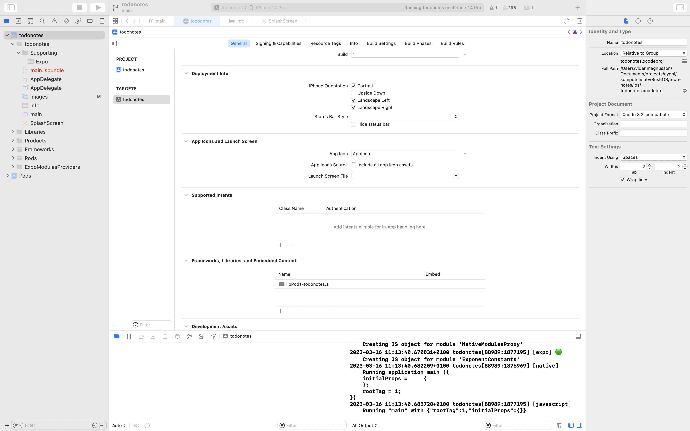
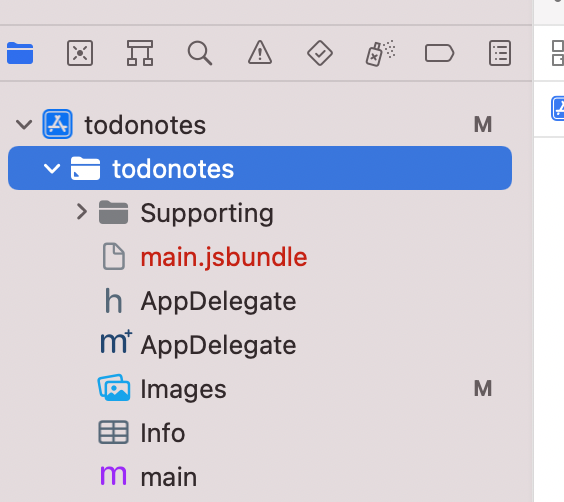
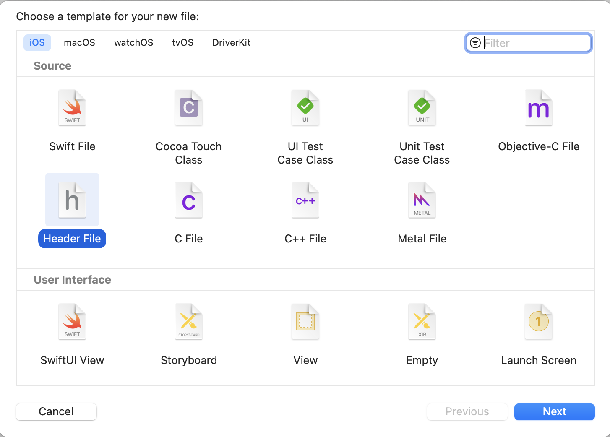
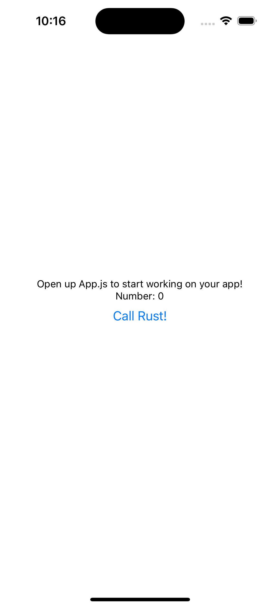

# Setting up a IOS App project with Rust and React native
This guide is for setting up an IOS app with a react-native frontend and a Rust library. The app that we will be building will be a very simple todo notes app.

## Installing XCode
First of all, for all IOS work we need to install x-code, there are numerous ways of doing this such as through the Mac Appstore or by running 

> `xcode-select --install`

## React-native & root project setup
We will mostly be following the [official react-native guide][react-native-guide] to setup an ios project but we will go through all the steps here as well. 

[react-native-guide]: https://reactnative.dev/docs/environment-setup

TL;DR, after installing the required dependencies I run the following commands:

> `npx create-react-native-app --typescript`

This will prompt you for two things:
 - Select a name, I just chose "todo-notes".
 - Default app vs expo template, choose default app.

When this is finished you should have a directory with the name of your app with a bunch of files and directories in it.
Among those the `ios/` directory, within which there should already be an xcode project.

Now we should be able to open the xcode project file `APP_NAME/ios/todonotes.xcworkspace` in xcode and press play (top-left ish corner).
This should open an IOS simulator as well as our app which should have some default text! 
Sometimes you might have to reload the app by using ___Command + R___ or even restart the simulator in xcode to get it to work

## Rust Setup
First we need to install Rust, for the most up to date information on how to do this go to this page: https://www.rust-lang.org/tools/install

### Setup cross-compilation capabilities
For us to compile our Rust code for the IOS devices (as well as the IOS simulator for testing purposes) we need to add a couple of architecture targets, we do this using `rustup target add TARGET`.

As of writing this we need the following targets:
 - IOS build target: `aarch64-apple-ios`
 - IOS simulator on M1/M2 macs: `aarch64-apple-ios-sim`
 - IOS simulator on x86_64 macs: `x86_64-apple-ios`

**Note** that you only need one of the simulator targets and it depends on the computer you are developing the app on.

**Note** that this guide is written for/on an arm mac and has not been tested on an x86_64 based mac. As such everything might not work exactly the same if you are on an x86_64 based mac.

For a full list of supported targets, see: https://doc.rust-lang.org/nightly/rustc/platform-support.html

TL;DR As of right now, if you are on an M1/M2 Mac, run:
```BASH
rustup target add aarch64-apple-ios aarch64-apple-ios-sim
```

### Setting up an IDE for Rust
There are unfortunately no dedicated IDEs for Rust as of now (that I know of).
However, there is support for Rust in most popular IDEs.
Some popular alternatives are:
 - IntelliJ (or other jetbrains IDE) with the Rust plugin.
 - NeoVim with some form of `rust-analyzer` integration.
 - VSCode with the `rust-analyzer` plugin.

When writing this guide I am using the last of the three, VSCode with the [rust-analyzer](https://marketplace.visualstudio.com/items?itemName=rust-lang.rust-analyzer) plugin.
Having some form of plugin for `.toml` support can also be useful.

### Creating the Rust project
Next up we need to create a rust project.
We do this using Cargo, the Rust package manager and we will do it inside the app folder created through the `npx create-react-native-app` command earlier.
I will call this app `rust-lib` since it will be the library for the app and will make it easier to distinguish from the other project directories (`frontend/`, `ios/` etc).

> `cargo new rust-lib` 

### The structure of the app
This seems like a good moment to explain how the app will be structured. The purpose of this guide and the reason why I feel its needed is because IOS supports neither React-native nor Rust natively, instead supporting objective-c and Swift. 
So for this app we will be using objective-c as a middle layer between react-native and Rust. 

For React-native, it is intended to be used partially on IOS and thus interactions between it and objective-C is relatively straight forward (we will come to that later).

For the Rust part, objective-C doesn't support interactions with Rust directly.
However, it does support interactions with C. 
Incidentally so does Rust! 
So the Rust codebase we will build will expose a C interface towards objective-C which will then connect that with the react-native code with some minor adjustments.

Full structure will be:
 - React-native
 - objective-c
 - C interface
 - Rust

### Start on Rust application
So back to the Rust project we created earlier.
Let's start working on that C interface in Rust so we have something we can test in objective-c!

When we created the project with `cargo new` earlier, it should have created a directory with the name of our project (in my case todo-lib).
Within this directory we find two things:
 - `Cargo.toml` Rust manifest file where we will specify dependencies, build targets etc.
 - `src/` the root directory for our Rust source code.

#### **Cargo.toml**
Let's start with `Cargo.toml`.
In this file we can specify all sorts of metadata information for our library, for a full list of things we can specify, see: https://doc.rust-lang.org/cargo/reference/manifest.html
For our purposes there is really only two things we need to do. 
First we need to specify that this should be a library, we do this using the `[lib]` tag. So we add

```TOML
[lib]
name = "todo_lib"
crate-type = ["staticlib"]
```

We notice that we also specify the crate type here, this is very important for our app to work in the App context. 
The `staticlib` means that we are building a static library without any linking. 
This means that all dependencies etc will be baked into the binary as those will otherwise not be availble on the IOS device.

There are a couple of things to point out here.
First of all, by default Rust will try to build a standalone  binary and look for a `main.rs` file in the `src/` directory and the `cargo new` command already created that for us. 
However, by specifying the `[lib]` tag, the main project will be a library and the compiler will instead look for a `lib.rs` file. 

#### **The `src/` directory**
Here we will put our source code and to follow on the point just made we need to delete the `main.rs` file and create a `lib.rs` file instead.

> `rm src/main.rs`

> `touch src/lib.rs`

In the `lib.rs` file we'll just add a simple function which will return a number so we can see that we can get a value from Rust to our app.

```Rust
#[no_mangle]
pub extern fn get_number() -> u32 {
    return 42;
}
```

As mentioned earlier, our rust interface must be compatible with C. 
Rust has pretty good build-in support for interacting with C and in this case we only need to make two adjustments from a standard Rust function.
 - First we have the `#[no_mangle]` macro which ensures that the name won't be mangled during compiletime so that we can reference it from C. 
 - Secondly we use `extern` to denote that this method should be callable from outside Rust.

#### **Compiling our Rust code for the first time**
We have some code, lets try to compile it!
Since we'll be running in the ios-simulator for now we will compile for the ios-simulator target.

`cargo build --release --target aarch64-apple-ios-sim`

This will build our binary to the `target/aarch64-apple-ios-sim/release/libPROJECT_NAME.a`

### Adding Rust to the XCode project
Now we have our Rust binary and its time to integrate into our XCode project.

 1. We open up the XCode project again and in the project explorer (leftmost tab in the left sidepanel) click on the root project.
 2. Ensure that the **target** is selected, not the project (should be selected by default).
 3. Under the general tab, scroll down to the "Frameworks, Libraries and Embedded content".
 
 See image:

Here we click on the `+`, "Add other", select the Rust binary we build earlier and press "open". It should be in `PROJECT_DIR/APP_NAME/rust-lib/target/aarch64-apple-ios-sim/release/libPROJECT_NAME.a`
It should now have been added to the list.

Next up we need to tell XCode where to look during linking which will be the directory that the binary we just selected resides in.
 1. Switch from the "General" tab to the "Build Settings" tab
 2. On the 'submenu' ensure that "All" and "Combined" are selected (see image below)
 3. Either scroll down to or search for "Library Search Paths"
 4. You should already have values for "Debug" and "Release" from react-native. We'll be using different library binaries for the Simulator and when running the app natively. So:
    1. Click on the "Debug" row and click the little `+` that shows up on it.
    2. Click on "Any Architecture | Any SDK" and select "IOS Simulator", it should now say "Any IOS Simulator SDK".
    3. Double click on the paths to the right of the row.
    4. Click on the `+` in the bottom left corner.
    5. Begin by writing `$(PROJECT_DIR)/`, that will ensure that the base path is in the `ios/APP_NAME.xcworkspace` directory. So for me the full path is `$(SRCROOT)/../rust-lib/target/aarch64-apple-ios-sim/release/` 
    6. Repeat the steps above for "Release"

#### **Creating the C header**
Now, for objective-c to understand our code we'll need a C header file representing our external Rust interface. In our case this will be very simple since we only have one very simple function.

We'll do this in our XCode project, right click the project directory and select "New File".


In the create menu, selected "Header File".


Then give it a name, I chose "RustBindings".

Now, open up the created file and within the generated `#define` and `#endif` commands, write:
```C
#pragma once

#include <stdint.h>

uint32_t get_number(void);
```

### Calling the Rust code & setting up an interface for React-native
To call our Rust code we need to create two new files, an objective-C and a header file to go along with it.

So similar to how we created the header file before, we now create a new objective-c file.
 1. Right click the project directory.
 2. Click "New File...".
 3. Selected "Objective-C File" and click "Next".
 4. Give it a name, I'll call mine "Bridge" as it will be a bridge between our react-native and rust codebases.
 5. Leave the File Type as "Empty File" and click "Next".
 6. Ensure that the target is selected and click "Create".

Then create the header file and give it the same name as the objective-c file, so "Bridge" in my case.
#### **Bridge.h**
Lets start in the header

In the header we will declare an interface that we will later have and be able to call methods on in react-native.
Again within the `#declare` and `#endif` macros
```objectivec
#import <React/RCTBridgeModule.h>

@interface SBridge : NSObject <RCTBridgeModule>
@end
```

In the objective-c file ("Bridge.m") we'll implement the interface and basically have functions that will be called from react-native and:
  1) Call rust functions
  2) Translate between C and React-native compatible data types.

First we need to import the two header files we've added:
```objectivec
#import "Bridge.h"
#import "RustBindings.h"
```

We'll also need to use 

We then need to implement the interface we created and export the module to React-Native.
```objectivec
@implementation SBridge

RCT_EXPORT_MODULE(SBridge);

@end
```

Inside the implementation we can put our functions!
Here I will just wrap the function we created in Rust and propagate the value to React-Native

```objectivec
RCT_EXPORT_METHOD(getNumber: (RCTResponseSenderBlock)callback)
{
  NSInteger num = get_number();
  callback(@[@(num)]);
}
```
Note that the function that will be called is the callback we get as an argument, so the function name (in javascript) will be `getNumber`.

And it all put together:
```objectivec
#import <Foundation/Foundation.h>
#import "Bridge.h"
#import "RustBindings.h"
#import <React/RCTLog.h>

@implementation SBridge

RCT_EXPORT_MODULE(SBridge);

RCT_EXPORT_METHOD(getNumber: (RCTResponseSenderBlock)callback)
{
  NSInteger num = get_number();
  RCTLogInfo(@"Got number from rust: %li", (long)num);
  callback(@[@(num)]);
}

@end
```

## Implement a simple frontend
Now we'll want to call our Rust code from React-Native (through objective-c) and display the value to the user!
In our root project folder you should have a file called `App.js`, lets open it up.

First we need to import our Objective-C module into React Native. 
We do this by adding `NativeModules` as an import from `react-native`.

`import { StyleSheet, Text, View, NativeModules } from 'react-native';`

We can then retrieve our module from that object.

```javascript
  const { SBridge } = NativeModules;
```

Finally we can call our method! Let's store the number in our state and we can display it as well.
The full `App.js` file now looks like this:

```javascript
import { StatusBar } from 'expo-status-bar';
import React, { useState } from 'react';
import { StyleSheet, Text, View, NativeModules, Button } from 'react-native';

export default function App() {
  const { SBridge } = NativeModules;
  const [number, setNumber] = useState(0);

  return (
    <View style={styles.container}>
      <Text>Open up App.js to start working on your app!</Text>
      <Text>Number: {number}</Text>
      <Button title={"Call Rust!"} onPress={() => {
        SBridge.getNumber(number => {
          setNumber(number)
        })
      }}/>
      <StatusBar style="auto" />
    </View>
  );
}

const styles = StyleSheet.create({
  container: {
    flex: 1,
    backgroundColor: '#fff',
    alignItems: 'center',
    justifyContent: 'center',
  },
});
```

And with that our app should now look like this:



If everything has been done correctly, when we press the button the `Number: 0` should be updated to `Number: 42`.

## Sending data to Rust
Currently we are only getting a value from Rust to our app, lets now send something the other way.
Instead of always sending 42 back, lets change it so that we take a number and send back that number times 2.

### Rust part
We start in Rust, updating our interface to something like this:
```rust
#[no_mangle]
pub extern fn get_number(input: u32) -> u32 {
    return input * 2;
}
```

Remember to save and recompile!

`cargo build --release --target aarch64-apple-ios-sim`

### Objective-C middle layer

For the objective-c middle layer we first need to update the C header to match our new function header.

In `RustBindings.h` we update the function header to 
```c
uint32_t get_number(uint32_t);
```

And we also need to update the objective-c code where we call it.
To get a number from react-native in our objective-c code we need to make some changes to our objective-c function:

```objectivec
RCT_EXPORT_METHOD(getNumber: (nonnull NSNumber *)number
                  callback: (RCTResponseSenderBlock)callback)
{
  NSInteger num = get_number(number.intValue);
  callback(@[@(num)]);
}
```

Note the `nonnull` modified for the input number, if you don't have that you'll get an error.

### Updating our javascript

Finally we'll update our `App.js` code.
```javascript
  // In our App() component
  const [number, setNumber] = useState(10);

  return (
    <View style={styles.container}>
      <Text>Open up App.js to start working on your app!</Text>
      <Text>Number: {number}</Text>
      <Button title={"Call Rust!"} onPress={() => {
        SBridge.getNumber(number, number => {
          setNumber(number)
        })
      }}/>
      <StatusBar style="auto" />
    </View>
  );
  // ...
```

The number will now start at `10` and each time we press the button it should double (until it overflows and is set to `0`).

## More complex types
So we're now able to pass simple values back and forth between our javascript and rust code.

However, numbers are very simple values. Not requiring any specific allocation or similar, however, how would we pass an object between javascript and rust?

We have a few different options, we can either allocate the object in objective-c and pass a reference to rust so it can fill it in.
Alternatively we can allocate the object in Rust and pass a reference to objective-c. 
They are both useful in different scenarios, the first is generally simpler but not always possible as we might not always know the size of the object to allocate in objective-c.

## What else?
Things that are likely to be required for a real-life App that are not covered in this guide:
 - Interacting with the device systems for things like:
   - Using the device sensors.
   - Storing data on the device.
   - Using built-in OS features such as FaceID or similar.
- Publishing / building the App for an actual device and not just the simulator